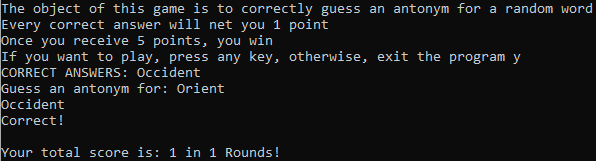

# Antonym Guesser: Dictionary API Game

The game will start with the user being given a random word.  
The user will have to guess an antonym for the given word.  
The user-given antonym must be on the approved list of antonyms given by Lingua Robot's english dictionary API.  
Rounds end after a user submits a word.  
The user is awarded one point if they correctly give an antonym on the approved list.  
The user will not be awarded any points if their word is not on the approved list.  
The user will play until they reach a score of 5.  
The user's overall score will be determined on the number of rounds it took them to finish.  

Side notes:
Not all words have antonyms  
If a word does have an antonym, it's under entries>entry>lexemes>antonymsets>antonyms  

